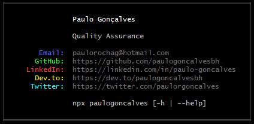

## Cartão de apresentação

[](https://npmjs.com/package/paulogoncalves)

<p align="center"></p>

### Pré-requisito

- [Node.js](https://nodejs.org/en/download/) instalado.

### Uso:

```
npx paulogoncalves
```

Utilizado também para tornar configurações de ambientes facilmente acessíveis, como o _gitconfig.ini_
